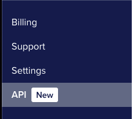

# Setuppalo

Build your small infrastructure, but do it!

This is a small study and test repo to create a sustainable and simple infrastructure on digital ocean using infrastructure as a code and best practices.

Warning: some things here may change or evolve, if you find some bugs please open an issue.

## Todo

- New ansible roles (Twingate, github actions, caprover)
- Dockbase CI/CD images
- Example with workflows
- Maintenance

## What you can find here

1. Basic security
2. Usage of VPN service (Twingate)
3. Usage of caprover to orchestrate the servers
4. Backups
5. Gitlab actions with custom runners
6. Setup of the machine
7. Dockbase CI/CD image
8. Simple maintenance workflow on gitlab
9. Usage of github secrets to avoid exposing password
10. Docker and docker compose

## Procedure

### Setup Digital Ocean

Generate a new ssh key for the machine: `ssh-keygen -t ed25519 -C "{your_email@example.com}"` and store the public key `server.pub` inside the folder `ssh_keys`.

Create a Digital Ocean API Key in the portal after the login with full permissions.



Create a new terraform variable file `terraform.tfvars`, use the `tfvars_template` as an example.

Modify the file `terraform/environments.tf` to add the specific of your machine.

Launch terraform

```bash
# initialize terraform
terraform init

# plan the execution
terraform plan

# launch the creation of the infrastructure
terraform apply

# destroy the infrastructure 
terraform destroy

# if you need to update terraform you can launch
terraform init -upgrade

```

To check the terraform volume snapshot you can use the command: `tail -f /var/log/volume-backup.log`

### Setup clouflare

Go to cloudflare and create a new domain.

Remember to associate your domain to work with cloudflare.

Create a new DNS entry with the new IPs created on digital ocean.

### Setup Ansible

When you define the servers with terraform and the domain with cloudflare remember to keep the DNS name or the machine name.

Now you need to setup the `.vault_pass` adding the vault password.
If you don't know what is it create a new one but remember that you have to recreate the old vault.

Then you need to define the servers inside `ansible`.

1. Copy the example dev1 and change the `vars.yml` with the correct information
2. If necessary change the passwords in the vault by doing: `ansible-vault edit ansible/host_vars/dev1/vault`
3. Change the file `inventory.yaml` if necessary to add new machine
4. Add your developers or users inside `group_vars/all.yml`
5. Add the developers or users keys inside `playbooks/keys`

Now you can launch ansible by doing:

```bash
# Enter inside the ansible folder
cd ansible

# Launch the server_config setup
ansible-playbook ./playbooks/server_config.yml 

# If you want to launch into a specific machine
ansible-playbook ./playbooks/server_config.yml -l "dev1"

# If you want to launch inside a specific machine and a dedicate role
ansible-playbook ./playbooks/server_config.yml -l "dev1" -t "users"
```
